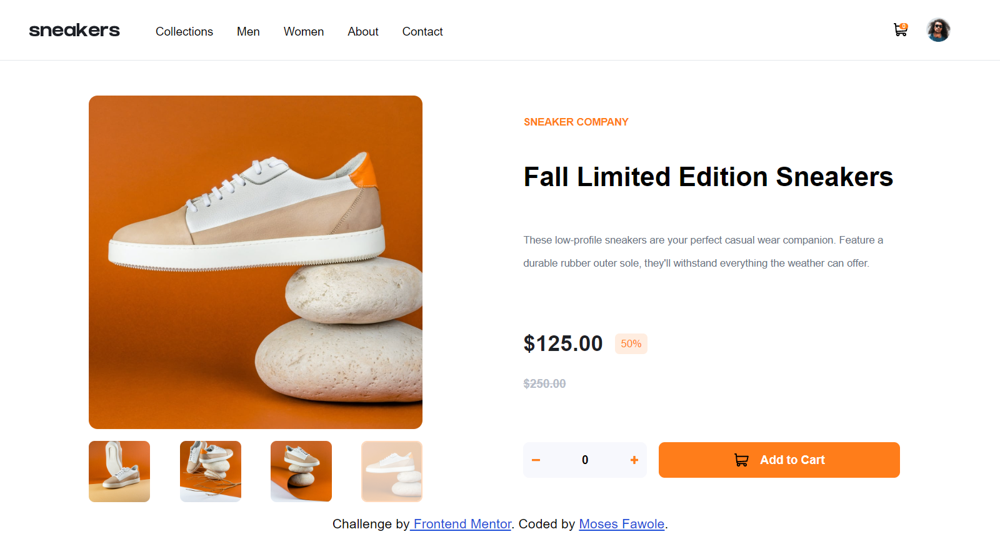
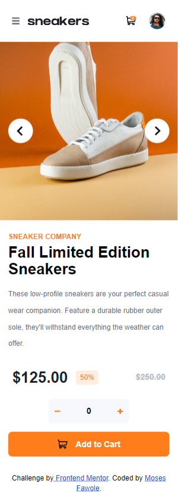
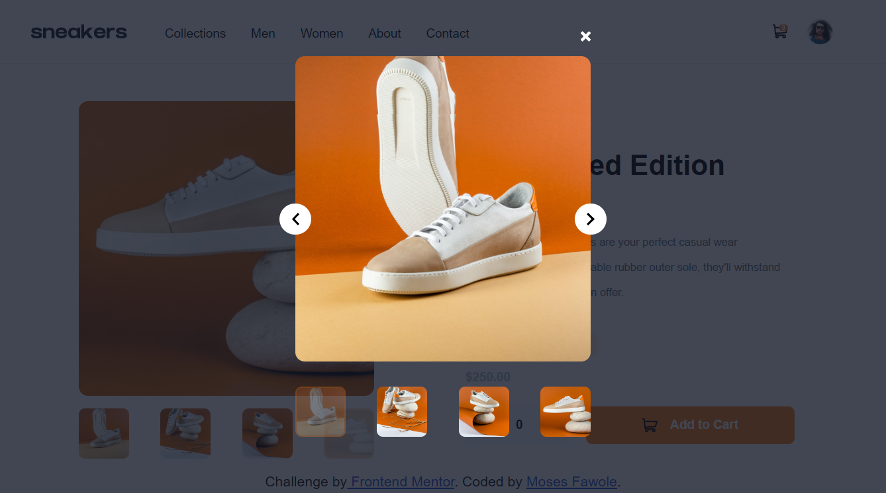

# Frontend Mentor - E-commerce product page solution

This is a solution to the [E-commerce product page challenge on Frontend Mentor](https://www.frontendmentor.io/challenges/ecommerce-product-page-UPsZ9MJp6). Frontend Mentor challenges help you improve your coding skills by building realistic projects.

## Table of contents

- [Overview](#overview)
  - [The challenge](#the-challenge)
  - [Screenshot](#screenshot)
  - [Links](#links)
- [My process](#my-process)
  - [Built with](#built-with)
  - [What I learned](#what-i-learned)
  - [Continued development](#continued-development)
  - [Useful resources](#useful-resources)
- [Author](#author)
- [Acknowledgments](#acknowledgments)

## Overview

### The challenge

Users should be able to:

- View the optimal layout for the site depending on their device's screen size
- See hover states for all interactive elements on the page
- Open a lightbox gallery by clicking on the large product image
- Switch the large product image by clicking on the small thumbnail images / I did hover instead
- Add items to the cart
- View the cart and remove items from it

### Screenshot





### Links

- Solution URL: [Source](https://your-solution-url.com)
- Live Site URL: [Live](https://e-commerce-one-delta-30.vercel.app/)

## My process

### Built with

- Semantic HTML5 markup
- CSS custom properties
- Flexbox
- CSS Grid
- Mobile-first workflow
- [React](https://reactjs.org/) - JS library
- [Vite](https://vitejs.dev/) - Frontend tooling
- [TailwindCss](https://tailwindcss.com/) - For styles
- [React hot toast](https://www.npmjs.com/react-hot-toast) - For notifications

### What I learned

```html
<h1>check CartContext.jsx</h1>
```

### Continued development

- Ehm, i think i'll want to focus on `perfect` reponsiveness haha
- minimal code
- better `best practices` haha

### Useful resources

- [Chat GPT](https://www.chat.openai.com) - This helped me solve some issues, I'd recommend to anyone, try not to copy the code,it'much better to learn the logic, why it will work, why it won't. Btw, `ChatGPT` is `mindblowing`, very hepful.

## Author

- Website - [Moses Fawole](https://www.github.com/mosesfawole)
- Frontend Mentor - [@mosesfawole](https://www.frontendmentor.io/profile/mosesfawole)
- Twitter - [@pharwoleh](https://www.twitter.com/pharwoleh)

## Acknowledgments

-I'll give `ChatGPT` some credit haha and myself also, did the enitire project without using someone else's solution
